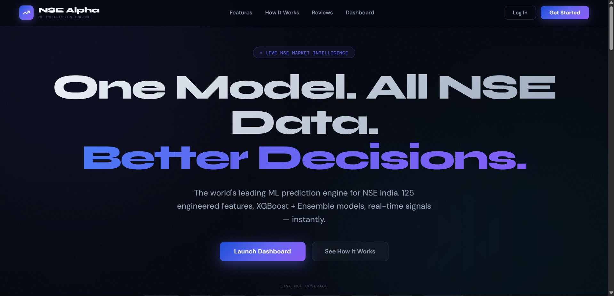
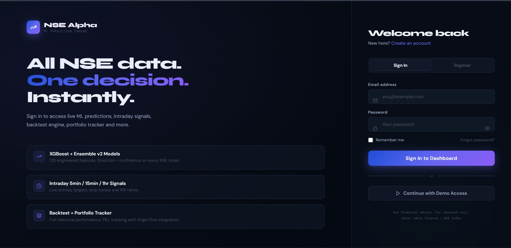
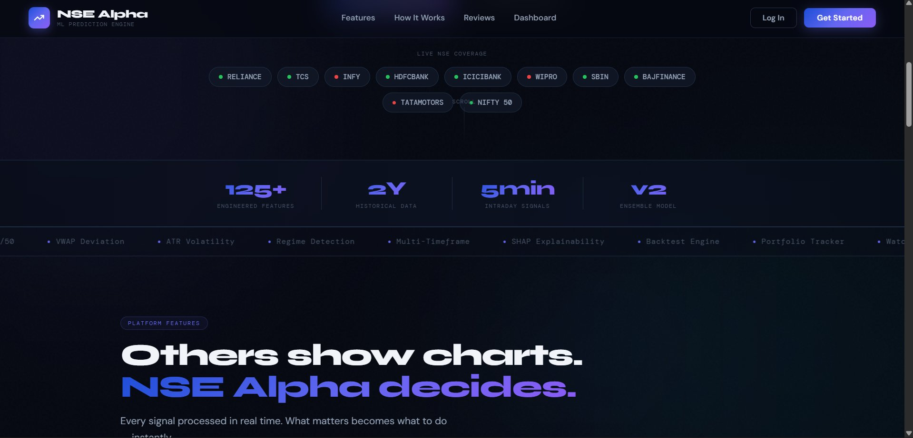
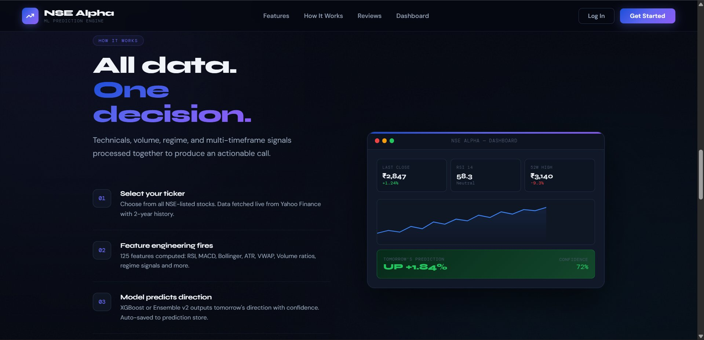

<div align="center">



<br/>

<h1>
  
</h1>

**ML-powered stock prediction engine for NSE India. One model. All NSE data. Better decisions.**

[](https://python.org)
[](https://xgboost.readthedocs.io)
[](https://lightgbm.readthedocs.io)
[](https://streamlit.io)
[](LICENSE)
[]()

</div>

---

## 📸 Screenshots

<table>
<tr>
<td width="50%">

<p align="center"><sub>Landing page hero with auth</sub></p>
</td>
<td width="50%">

<p align="center"><sub>Split-screen login & signup</sub></p>
</td>
</tr>
<tr>
<td width="50%">

<p align="center"><sub>Live NIFTY 50 coverage + stats bar</sub></p>
</td>
<td width="50%">

<p align="center"><sub>How It Works — dashboard preview</sub></p>
</td>
</tr>
</table>

---

## 🧠 What is NSE Alpha?

NSE Alpha is a **production-grade ML prediction engine** for the Indian stock market. It ingests live NSE price data, engineers 125+ technical features, runs an XGBoost + LightGBM + RandomForest ensemble, and surfaces direction predictions, intraday signals, regime classification, and portfolio analytics — all wrapped in a premium Streamlit dashboard and a modern HTML/CSS/JS landing page.

> ⚠️ **Disclaimer:** NSE Alpha is a research and educational tool. It is **not** financial advice. Past model performance does not guarantee future results. Never risk capital you cannot afford to lose.

---

## ✨ Key Features

| Feature | Description |
|---------|-------------|
| 🤖 **v2 Ensemble Model** | XGBoost + RandomForest + LightGBM soft-vote ensemble, Optuna-tuned |
| 📐 **125+ Features** | RSI, MACD, Bollinger, ATR, VWAP, Volume ratios, ROC, Stochastics, and more |
| ⚡ **Intraday Scanner** | 5min / 15min / 1hr multi-timeframe signals with entry, target, stop-loss & R:R |
| 🎯 **Regime Detection** | BULL / BEAR / SIDEWAYS classifier using 7 weighted indicators |
| 📊 **Backtesting Engine** | Walk-forward CV, Sharpe ratio, max drawdown, alpha vs Buy-and-Hold |
| 📜 **Prediction History** | SQLite store with outcome tracking and accuracy analytics |
| ⭐ **Watchlist** | Up to 20 NIFTY stocks with live prices, sparklines, and signals |
| 💼 **Portfolio Tracker** | Angel One SmartAPI integration + manual holdings, P&L vs NIFTY 50 |
| 🔔 **Alerts** | WhatsApp (Twilio) + Email (Gmail SMTP) daily prediction delivery |
| 🌐 **Landing Page** | Full HTML/CSS/JS marketing site with auth flow and live ticker |
| 📈 **SHAP Explainability** | Feature-level explanation for every prediction |
| 🐦 **FinBERT Sentiment** | News sentiment scoring integrated into features |

---

## 🖥️ Project Structure

```
nse-alpha/
│
├── app/
│   └── streamlit_app.py        # Main Streamlit dashboard (7 tabs)
│
├── landing/                    # HTML/CSS/JS landing page
│   └── index.html              # Full marketing site + auth modals
│
├── src/                        # Core Python modules
│   ├── feature_engineering.py  # 125+ feature builder
│   ├── model_training.py       # v1 XGBoost pipeline
│   ├── model_v2.py             # v2 Ensemble + Optuna tuning
│   ├── backtesting.py          # Walk-forward backtesting engine
│   ├── evaluation.py           # Sharpe, drawdown, accuracy metrics
│   ├── regime_detection.py     # Bull/Bear/Sideways classifier
│   ├── intraday.py             # Multi-timeframe intraday scanner
│   ├── prediction_store.py     # SQLite prediction history
│   ├── watchlist.py            # Watchlist manager (20 stocks)
│   ├── broker_angel.py         # Angel One SmartAPI integration
│   ├── alerts.py               # WhatsApp + Email alert system
│   ├── sentiment.py            # FinBERT news sentiment
│   ├── explainability.py       # SHAP explainability layer
│   ├── data_loader.py          # NSE/yFinance data pipeline
│   ├── portfolio.py            # Portfolio P&L analytics
│   └── utils.py                # Config, logging, path helpers
│
├── scripts/                    # CLI runners
│   ├── run_data_pipeline.py
│   ├── run_feature_engineering.py
│   ├── run_model_training.py
│   ├── run_training_v2.py      # Train Ensemble v2 on all 50 tickers
│   ├── run_backtesting.py
│   ├── run_intraday.py         # Live intraday scanner (--loop, --alert)
│   ├── run_alerts.py           # Daily alert dispatcher
│   └── run_explainability.py
│
├── models/                     # Trained model files (.pkl)
│   ├── xgboost_{task}_{TICKER}.pkl
│   └── ensemble_{task}_{TICKER}.pkl
│
├── data/
│   ├── raw/                    # Downloaded OHLCV CSVs
│   ├── processed/              # Feature matrices
│   └── external/               # Sentiment, news data
│
├── results/                    # Backtest reports, exports
├── notebooks/                  # Exploratory Jupyter notebooks
├── tests/                      # Unit tests
├── kaggle_v2_notebook.py       # Self-contained Kaggle training notebook
├── config.yaml                 # Single source of truth for all parameters
├── requirements.txt
└── setup.sh
```

---

## 🚀 Quick Start

### 1. Clone & install

```bash
git clone https://github.com/your-username/nse-alpha.git
cd nse-alpha

python -m venv venv
source venv/bin/activate          # Windows: venv\Scripts\activate

pip install -r requirements.txt
```

### 2. Configure

```yaml
# config.yaml — edit before running
data:
  tickers:
    - "RELIANCE.NS"
    - "TCS.NS"
    # ... add your NIFTY 50 tickers

broker:
  angel_one:
    enabled: false               # Set true + add credentials for live holdings
    api_key: "YOUR_API_KEY"
    client_id: "YOUR_CLIENT_ID"
    password: "YOUR_MPIN"
    totp_key: "YOUR_TOTP_SECRET"

alerts:
  whatsapp:
    enabled: false               # Set true + Twilio credentials
    account_sid: "ACxxxxxxxx"
    auth_token: "xxxxxxxx"
    from_number: "whatsapp:+14155238886"
    to_number: "whatsapp:+91XXXXXXXXXX"
  email:
    enabled: false               # Set true + Gmail app password
    sender: "you@gmail.com"
    password: "your_app_password"
    recipients: ["you@gmail.com"]
```

### 3. Download data & train

```bash
# Download historical data for all configured tickers
python scripts/run_data_pipeline.py

# Engineer 125+ features
python scripts/run_feature_engineering.py

# Train v1 XGBoost models (fast)
python scripts/run_model_training.py

# Train v2 Ensemble models with Optuna (recommended)
python scripts/run_training_v2.py
```

### 4. Launch the dashboard

```bash
streamlit run app/streamlit_app.py
```

Open `http://localhost:8501` in your browser.

---

## 🌐 Landing Page

The landing page is a standalone HTML file — no build step required:

```bash
# Open directly in browser
open landing/index.html

# Or serve with Python
python -m http.server 3000 --directory landing
```

The landing page includes:
- Animated hero section with live ticker strip (all 50 NIFTY stocks)
- How It Works (4-step workflow)
- Platform Features section
- Stats bar (counters animate on scroll)
- **Functional Login + Signup modals** with form validation and session storage
- NIFTY 50 coverage tiles
- Footer with social links

---

## 📊 Dashboard Tabs

The Streamlit dashboard has **7 tabs**, all accessible from the main interface:

| Tab | Contents |
|-----|----------|
| 📊 **Backtest** | Cumulative returns vs Buy-and-Hold, Sharpe, max drawdown, monthly returns heatmap |
| 🔬 **Features** | Top-20 feature importance bar chart, latest feature values table, correlation heatmap |
| 📋 **Data** | Raw OHLCV data viewer, feature matrix preview |
| ⚡ **Intraday** | Real-time 5min/15min/1hr signals, entry/target/stop-loss/R:R cards |
| 📜 **History** | Prediction accuracy over time, win rate chart, per-ticker accuracy breakdown |
| ⭐ **Watchlist** | Up to 20 stocks with live price, %-change, sparkline, AI signal badge |
| 💼 **Portfolio** | Holdings P&L, allocation pie chart, portfolio vs NIFTY 50, prediction P&L table |

---

## 🤖 ML Models

### v1 — XGBoost Pipeline

```
fetch_price_data() → FeatureEngineer.build() → XGBClassifier/Regressor
                                                       ↓
                                            predict(X_latest) → UP/DOWN + score
```

### v2 — Ensemble with Optuna

```
fetch_price_data() → FeatureEngineer.build() → Feature Selection (top 40)
                                                       ↓
                              ┌────────────────────────┼────────────────────────┐
                         XGBoost ×2              RandomForest ×1         LightGBM ×1
                              └────────────────────────┼────────────────────────┘
                                                 Soft Vote Ensemble
                                                       ↓
                                            UP/DOWN + confidence score
```

**Expected accuracy improvement:** 53–56% (v1) → 59–64% (v2) directional accuracy.

### Feature Categories

| Category | Features |
|----------|----------|
| **Trend** | SMA 5/10/20/50/200, EMA 5/10/20/50, Golden/Death Cross |
| **Momentum** | RSI 7/14/21, MACD, MACD Signal, ROC 10/20 |
| **Volatility** | Bollinger Bands, BB %B, BB Width, ATR 14, Keltner Channels |
| **Volume** | Volume ratio, OBV, MFI, VWAP deviation |
| **Pattern** | Stochastic %K/%D, Williams %R, CCI |
| **Statistical** | Log returns, rolling std, skewness, autocorrelation |
| **Lag** | 1-day, 2-day, 3-day lag features |
| **Multi-timeframe** | 3-day and 5-day directional targets |

---

## ⚡ Intraday Scanner

Run the live intraday scanner independently:

```bash
# Single scan
python scripts/run_intraday.py --ticker RELIANCE.NS

# Continuous loop (every 15 min during market hours)
python scripts/run_intraday.py --ticker RELIANCE.NS --loop

# Loop + send WhatsApp/Email alerts on strong signals
python scripts/run_intraday.py --ticker RELIANCE.NS --loop --alert
```

Each timeframe (5min, 15min, 1hr) returns:

```json
{
  "direction": "UP",
  "confidence": 0.74,
  "strength": "STRONG",
  "targets": {
    "entry":      2847.15,
    "target":     2890.30,
    "stop_loss":  2820.00,
    "rr_ratio":   1.6,
    "reward_pct": 1.51,
    "risk_pct":   0.95
  }
}
```

---

## 🎯 Regime Detection

The `RegimeDetector` classifies current market conditions using a 7-indicator weighted voting system:

| Indicator | Weight | Signal |
|-----------|--------|--------|
| SMA 50 vs SMA 200 (Golden/Death Cross) | 2.0 | Trend |
| RSI 14 | 1.5 | Momentum |
| MACD vs Signal | 1.5 | Momentum |
| Bollinger Band Width | 1.5 | Volatility |
| Price vs SMA 20 | 1.0 | Short-term trend |
| ROC 20 | 1.0 | Rate of change |
| Volume Ratio | 0.5 | Confirmation |

Output: `BULL 🐂 | BEAR 🐻 | SIDEWAYS ↔` with confidence score (0–100%).

---

## 🔔 Alerts

### Daily prediction alerts

```bash
python scripts/run_alerts.py
```

Sends predictions for all configured tickers to:
- **WhatsApp** via Twilio API
- **Email** via Gmail SMTP

### Alert format

```
📈 NSE Alpha — Daily Predictions [26 Apr 2025]

RELIANCE.NS  →  UP ▲  (+1.84%)  Conf: 74%  Regime: 🐂 BULL
TCS.NS       →  DOWN ▼ (-0.92%) Conf: 68%  Regime: ↔ SIDEWAYS
...

⚠ Not financial advice. Research only.
```

---

## 🏋️ Kaggle Training

For GPU-accelerated training on all 50 NIFTY stocks:

```python
# Upload to Kaggle as a notebook and run
# kaggle_v2_notebook.py — self-contained, handles all imports

# Cell 1: Install
!pip install -q loguru xgboost==2.0.3 lightgbm optuna yfinance ta pyyaml scikit-learn joblib

# Cell 2: Setup paths
# Cell 3: Write model_v2.py (base64 encoded — avoids quote escaping)
# Cell 4: Train all 50 tickers with Optuna
# Cell 5: Export models as zip
```

---

## 🔗 Broker Integration

NSE Alpha supports **read-only** Angel One SmartAPI integration:

```python
# config.yaml
broker:
  angel_one:
    enabled: true
    api_key: "your_api_key"
    client_id: "your_client_id"
    password: "your_mpin"
    totp_key: "your_totp_secret"
```

```bash
pip install smartapi-python pyotp
```

The integration fetches:
- Live holdings and quantities
- Current market prices (LTP)
- Invested value and P&L calculations

> 🔒 **Security:** Read-only access only. NSE Alpha never places or cancels orders.

---

## 🧪 Running Tests

```bash
pytest tests/ -v

# With coverage
pytest tests/ --cov=src --cov-report=term-missing
```

---

## 📦 Deployment

### Local (Streamlit)

```bash
streamlit run app/streamlit_app.py --server.port 8501
```

### Docker

```dockerfile
FROM python:3.10-slim
WORKDIR /app
COPY requirements.txt .
RUN pip install -r requirements.txt
COPY . .
EXPOSE 8501
CMD ["streamlit", "run", "app/streamlit_app.py", "--server.address=0.0.0.0"]
```

```bash
docker build -t nse-alpha .
docker run -p 8501:8501 nse-alpha
```

### Streamlit Cloud

1. Push to GitHub
2. Go to [share.streamlit.io](https://share.streamlit.io)
3. Select `app/streamlit_app.py` as the entrypoint
4. Add `config.yaml` contents to Streamlit Secrets

---

## 🗺️ Roadmap

- [x] v1 XGBoost regression + classification models
- [x] 125+ engineered features
- [x] Walk-forward backtesting engine
- [x] SHAP explainability
- [x] FinBERT news sentiment
- [x] Regime detection (Bull/Bear/Sideways)
- [x] WhatsApp + Email daily alerts
- [x] Multi-day prediction (3d/5d)
- [x] v2 Ensemble (XGBoost + RF + LightGBM) + Optuna
- [x] Intraday scanner (5min/15min/1hr)
- [x] Prediction history store (SQLite)
- [x] Watchlist (20 stocks)
- [x] Angel One portfolio integration
- [x] HTML/CSS/JS landing page with auth
- [ ] LSTM/GRU deep learning model
- [ ] Options chain data integration
- [ ] FII/DII flow signals
- [ ] Sector rotation detector
- [ ] Telegram bot integration
- [ ] REST API (FastAPI)

---

## 🛠️ Tech Stack

| Layer | Technology |
|-------|------------|
| **Language** | Python 3.10+ |
| **ML Models** | XGBoost 2.0, LightGBM 4.1, scikit-learn 1.3 |
| **Hyperparameter Tuning** | Optuna (Bayesian search) |
| **Feature Engineering** | pandas-ta, ta, custom |
| **Data** | yFinance, nsepy, NSE India |
| **Dashboard** | Streamlit 1.29 |
| **Charts** | Plotly 5.18 |
| **Explainability** | SHAP 0.44 |
| **Sentiment** | FinBERT (HuggingFace Transformers) |
| **Broker API** | Angel One SmartAPI |
| **Alerts** | Twilio (WhatsApp), Gmail SMTP |
| **Storage** | SQLite (predictions), CSV (exports) |
| **Frontend** | HTML5 / CSS3 / Vanilla JS |
| **Deployment** | Streamlit Cloud / Docker |

---

## 📄 License

This project is licensed under the **MIT License** — see [LICENSE](LICENSE) for details.

---

## 🙏 Acknowledgements

- [Yahoo Finance](https://finance.yahoo.com) — Historical price data
- [NSE India](https://www.nseindia.com) — Live market data
- [Angel One SmartAPI](https://smartapi.angelbroking.com) — Broker integration
- [XGBoost](https://xgboost.readthedocs.io) — Gradient boosting
- [Optuna](https://optuna.org) — Hyperparameter optimization
- [SHAP](https://shap.readthedocs.io) — Model explainability
- [Streamlit](https://streamlit.io) — Dashboard framework

---

<div align="center">

**Built with ❤️ for the Indian retail trader**

*NSE Alpha · ML Prediction Engine · Not Financial Advice*

</div>
